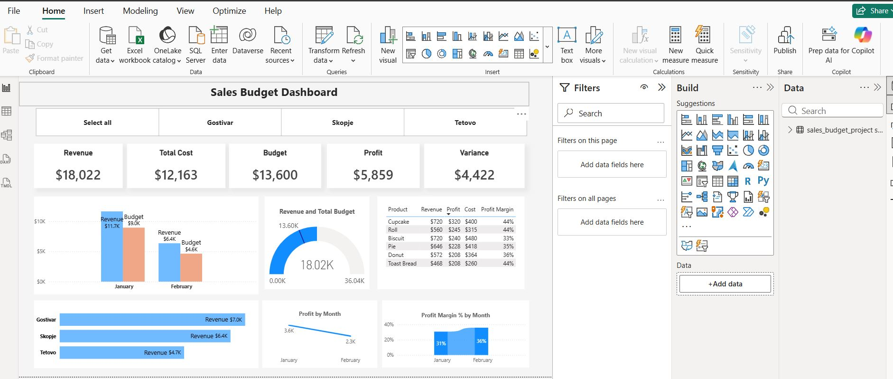

# 📊 Sales Budget Analytics Project


## 🚀 Project Overview

The **Sales Budget Analytics Project** is an end-to-end Business Intelligence solution designed to evaluate sales performance against budget targets.

The project demonstrates the complete analytics workflow:

**Excel → Python ETL → MySQL → Power BI Dashboard**

By transforming raw sales data into actionable insights, decision-makers can monitor profitability, track budget variances, and identify top-performing products and locations.

---

## 🎯 Business Problem

Organizations often struggle to understand whether actual sales performance aligns with planned budgets.

This project helps answer questions such as:

* Are sales meeting budget expectations?
* Which products generate the highest revenue?
* Which locations perform best?
* Where do positive or negative variances occur?
* How profitable is the business overall?

---

## 🏗️ Solution Architecture

```text
Excel Data Source
       │
       ▼
Python ETL Pipeline
(Pandas + SQLAlchemy)
       │
       ▼
MySQL Database
       │
       ▼
Power BI Data Model
       │
       ▼
Interactive Dashboard
```

---

## 🛠️ Technologies Used

| Technology | Purpose             |
| ---------- | ------------------- |
| Excel      | Raw data source     |
| Python     | ETL process         |
| Pandas     | Data transformation |
| SQLAlchemy | Database connection |
| MySQL      | Data storage        |
| Power BI   | Data visualization  |
| DAX        | KPI calculations    |

---

## ⚙️ ETL Process

### Extract

* Imported raw sales data from Excel

### Transform

* Cleaned and standardized data
* Converted date fields
* Removed inconsistencies
* Generated business metrics

```python
Revenue = Sales_Price * Quantity

Cost_Total = Cost_Price * Quantity

Profit = Revenue - Cost_Total

Budget_Value = Budget_Price * Quantity

Variance = Revenue - Budget_Value
```

### Load

* Exported transformed data to CSV
* Loaded final dataset into MySQL

---

## 📈 Dashboard Features

### Executive KPIs

* Revenue
* Profit
* Cost
* Quantity Sold
* Budget Value
* Variance

### Performance Analysis

* Budget vs Actual Sales
* Revenue Trends
* Profitability Analysis
* Product Performance
* Location Performance
* Variance Tracking

### Interactive Capabilities

* Dynamic Filters
* Drill-Down Analysis
* Cross-Filtering
* Time-Based Analysis

---

## 📊 Dashboard Screenshots

### Executive Dashboard



### Revenue & Profit Analysis


### Budget Variance Analysis


---

## 📌 Key Business Metrics

| Metric        | Description         |
| ------------- | ------------------- |
| Revenue       | Total sales value   |
| Cost          | Total cost incurred |
| Profit        | Revenue minus cost  |
| Budget Value  | Expected revenue    |
| Variance      | Actual vs Budget    |
| Quantity Sold | Total units sold    |

---

## 💡 Skills Demonstrated

* Data Cleaning
* Data Transformation
* ETL Pipeline Development
* SQL Database Integration
* Power BI Data Modeling
* DAX Calculations
* KPI Reporting
* Dashboard Development
* Business Analytics
* Data Visualization
* Problem Solving

---

## 📂 Project Structure

```bash
Sales_Budget_Analytics_Project/
│
├── data/
│   ├── sales_budget_data.xlsx
│   └── cleaned_sales_data.csv
│
├── scripts/
│   └── etl.py
│
├── sql/
│
├── powerbi/
│   └── Sales_Budget_Dashboard.pbix
│
├── screenshots/
│   ├── dashboard-overview.png
│   ├── revenue-analysis.png
│   └── variance-analysis.png
│
└── README.md
```

---

## 🔮 Future Enhancements

* Sales Forecasting using Python
* Advanced DAX Measures
* Automated Data Refresh
* Fabric Lakehouse Integration
* Executive-Level Dashboard Redesign
* Scenario and What-If Analysis

---

## 👨‍💻 Author

### Altin Salihi

Data Analyst | Business Intelligence Analyst | Power BI Specialist

📧 [altinsalihi123@gmail.com](mailto:altinsalihi123@gmail.com)

🔗 LinkedIn: https://linkedin.com/in/altin-salihi-93a20895

---

⭐ If you found this project interesting, feel free to star the repository.
